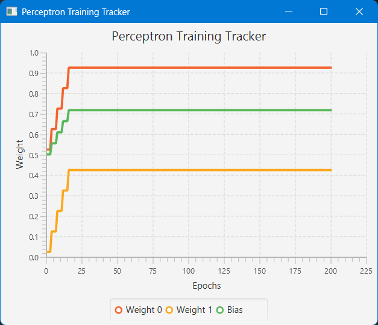
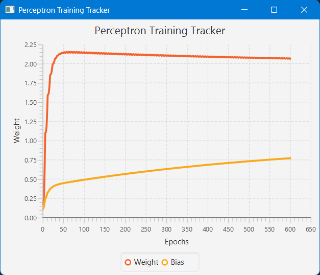
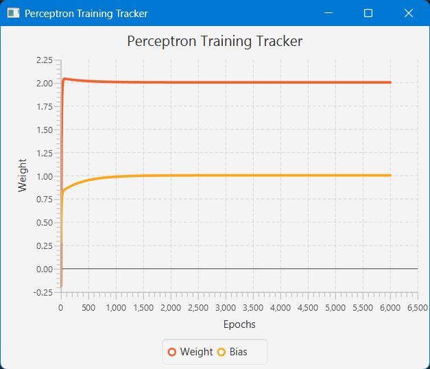
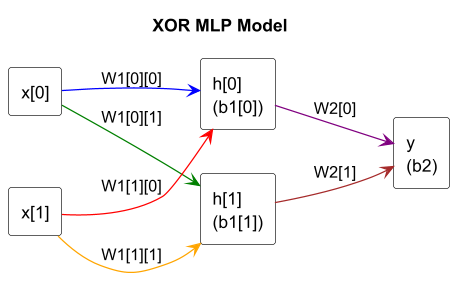
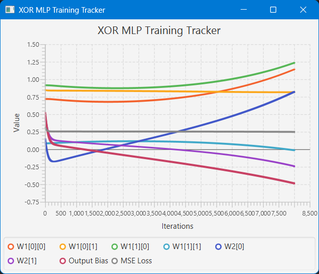

# Logic Gates Perceptron

This repository implements **perceptron models for logic gates** using Java. It contains:

- **SLP (Single-Layer Perceptron)** for the **AND gate**  
- **Linear SLP** for non-classification problems (e.g., regression: y = 2x + 1)  
- **MLP (Multi-Layer Perceptron)** for the **XOR gate**  

The project also includes tracking of the learning process and visualization of weights, biases, and outputs during training.

---

## Table of Contents

- [SLP AND](#slp-and)
- [SLP Linear](#slp-linear)
- [MLP XOR Model](#mlp-xor-model)
- [Usage](#usage)

---

## SLP AND



> **Note:** For the **+2 threshold**, the perceptron bias **increases** to help reach the activation threshold for producing output `1`.


> **Note:** For the **-2 threshold**, the perceptron bias **decreases** to adjust the weighted sum so that the neuron can still activate correctly.

- A **single-layer perceptron** for the AND gate.  
- **Learning rate:** Can be increased to hasten learning but should be chosen cautiously; too high may prevent fine-tuning.  
- **Activation function:** Step function ```return weightedSum >= threshold ? 1 : 0 ``` for classification.  

> Key idea: For classification problems, the perceptron outputs discrete values using a step function.

---

## SLP Linear



> **Note:** This is an **unfinished training** of the SLP for the regression function `y = 2x + 1`.  
> The network has a **small learning rate** and **insufficient epochs**, so the weights and bias have not yet reached their optimum values.



> **Note:** This shows the **finished training** of the SLP for `y = 2x + 1`.  
> The network has now **converged** with appropriate weights and bias, closely approximating the target linear mapping.

- For **non-classification / regression problems**.  
- **Regression function used for testing:** `y = 2x + 1`  
- **Activation function:** Identity (linear), no step function required as it's a non-classification problem.  

> Notes:
> - Step functions are avoided because the model must approximate a **continuous mapping** (`y = 2x + 1`).  
> - Using a nonlinear step function in regression would throw away useful information.

---

## MLP XOR Model



- **Multi-layer perceptron (MLP)** implemented to solve XOR, which cannot be solved by a single-layer perceptron.  
- Tracks **Mean Squared Error (MSE)** loss and weight/bias changes during training.

**Training Results:**  

**Final Predictions:**  

Epoch 0, MSE Loss: 0.308586  
Epoch 1000, MSE Loss: 0.252861

| Input      | Predicted | Target |
|-----------|-----------|--------|
| [0, 0]    | 0.4733    | 0.0    |
| [0, 1]    | 0.5152    | 1.0    |
| [1, 0]    | 0.5043    | 1.0    |
| [1, 1]    | 0.5232    | 0.0    |



**Observations:**  

- Loss stabilizes around **0.25**, not decreasing further due to the simplicity of the network.  
- Weights like `w2[1]`, `w1[1][1]`, and output bias `b2` decrease while balancing the increasing `w2[0]`, `w1[0][0]`, and `w1[1][0]`.  
- Network finds an approximate solution, showing the limitations of small MLPs for XOR with sigmoid activations.

---

## Usage

1. Clone the repository:

```bash
git clone https://github.com/your-username/logic-gates-perceptron.git
```

2. FXPlot plotting utility:

This project uses FXPlot

Local Installation:

Since FXPlot is not yet published to Maven Central, you can use JitPack to include FXPlot as a dependency. 

Add this repository to your pom.xml:
```xml
<repositories>
  <repository>
    <id>jitpack.io</id>
    <url>https://jitpack.io</url>
  </repository>
</repositories>
```

Then add the dependency:
```xml
<dependencies>
  <dependency>
    <groupId>com.github.muichi-mon</groupId>
    <artifactId>fxplot</artifactId>
    <version>master-SNAPSHOT</version>
  </dependency>
</dependencies>
```

If using Java modules, add the following line to your module-info.java:
```xml
module your.module.name {
    requires io.github.rajveer.fxplot;
}
```
